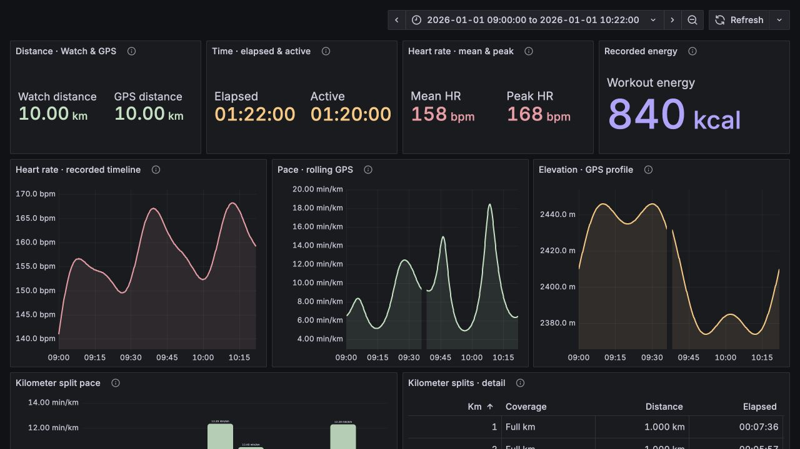
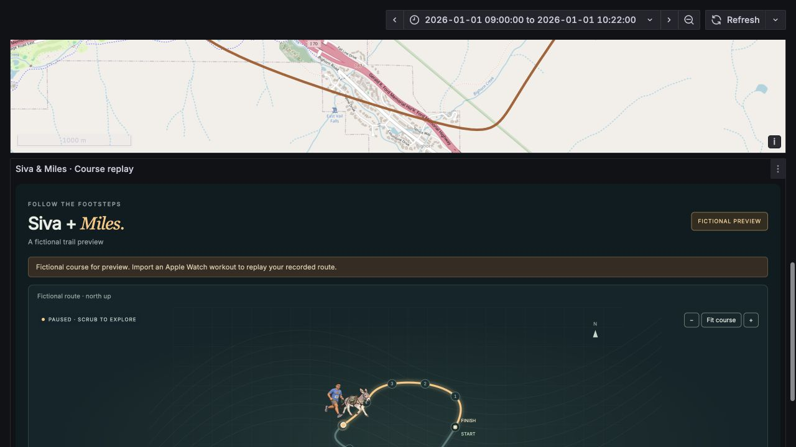
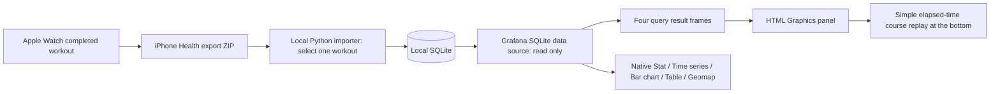

# Burro Race Replay · Siva & Miles

A personal race journal inside **Grafana**: native panels at the top analyze distance, duration, heart rate, pace, elevation and kilometer splits. A simple animated course replay at the bottom follows Siva and Miles along the recorded timestamps. The illustrated team is based on supplied race and portrait photos, with the face revised using the clearer reference portraits.

**Current status: the latest Running workout has been imported from the supplied Apple Health archive into local Grafana.** The local dashboard replays the recorded GPS course over OpenStreetMap and includes device provenance. Raw Health data and the exact recorded route remain local.

The screenshots below use an isolated fictional preview for privacy. Its 10 km / 82-minute values and schematic course are demonstration data, not Siva's result. The local dashboard uses the actual recorded course over a real map.

**Native analysis first:**



**Simple animated replay at the bottom:**



[Open the local Grafana dashboard](http://127.0.0.1:3030/d/burro-race-replay/burro-race-c2b7-siva-and-miles?orgId=1&kiosk) · [Export instructions](docs/export-workout.md) · [Data contract](docs/data-contract.md) · [Grafana setup](docs/setup-grafana.md)

## 1. Export the workout from Apple Watch / iPhone

Use the **iPhone paired with the watch** after the completed workout has synced:

1. Open **Health → Summary → your profile picture or initials**.
2. Tap **Export All Health Data** and let the export finish.
3. **AirDrop the ZIP to this Mac**, or save it to Files and transfer it locally.
4. Keep the ZIP in a private local folder. You can give the assistant its **local file path**; the full archive need not be uploaded into chat or GitHub.
5. Identify the burro race from the workout list using its date, approximately **10:30 Mountain time**, activity and distance. Use the export's recorded UTC offset to distinguish MST from MDT. Do not choose a different run merely because it is close to 10 km.

Apple's built-in export covers all Health data. The importer selects **one workout** and retains only its supported summary, linked route, and overlapping heart-rate samples. [Apple's official export instructions](https://support.apple.com/guide/iphone/share-your-health-data-iph5ede58c3d/ios).

A third-party workout exporter can provide just one run. [HealthFit](https://apps.apple.com/us/app/healthfit/id1202650514) offers FIT, GPX and other export formats. This repository currently accepts **GPX and native Health ZIP/XML**, not FIT/TCX/CSV. A GPX-only import supplies the course and timing but this importer does not ingest its extension metrics; the native ZIP is preferred for heart rate, pauses and workout totals. No additional app is required for the native route.

The route must have been recorded by the watch. A screenshot of the Fitness summary can help identify the race but cannot replace timestamped GPS data. See [the full export guide](docs/export-workout.md) for archive structure, minimum inputs and missing-route cases.

## 2. Parse just this race and store it locally

Requires **Python 3.9+**, standard library only. Run commands from this repository directory:

```sh
# List workouts; no database is created and no data is uploaded.
python3 scripts/import_workout.py /path/to/export.zip --list

# Explicitly import ONLY the latest Running activity (ignores later walks/other types).
python3 scripts/import_workout.py /path/to/export.zip \
  --latest-running --device-label "Apple Watch Ultra 4" \
  --title 'Burro Race · Siva & Miles' --db runtime/workout.sqlite --replace

# Alternatively use the actual 1-based index printed above, for example 42.
python3 scripts/import_workout.py /path/to/export.zip \
  --workout 42 --title 'Burro Race · Siva & Miles' \
  --db runtime/workout.sqlite

# When replacing the fictional preview or a previously selected workout:
python3 scripts/import_workout.py /path/to/export.zip \
  --workout 42 --title 'Burro Race · Siva & Miles' \
  --db runtime/workout.sqlite --replace

# Route-only alternative (timestamped GPX required):
python3 scripts/import_workout.py /path/to/race.gpx \
  --db runtime/workout.sqlite --replace
```

`--date YYYY-MM-DD` narrows the list using each workout's recorded local date. More than one matching workout requires explicit selection; the importer refuses ambiguity. `--latest-running` explicitly selects the maximum timezone-aware start time among Running activities, and refuses a tie. It streams XML, reads only route files referenced by the selected workout, converts supported units, normalizes timestamps to UTC and validates coordinates. It does not unpack the full archive or load it into a cloud database. Invalid paths and external URLs are rejected.

A completed import creates a single-workout SQLite database atomically with owner-only file permissions. Four tables supply Grafana:

| Table | Stored information | Grafana query |
| --- | --- | --- |
| `race` | Source, times, watch/GPS distance, duration, energy when available, HR summaries, warnings, pauses, synthetic flag | A |
| `route_points` | Original lat/lon, elapsed time, altitude, cumulative eligible GPS distance, rolling pace, segment boundaries | B |
| `splits` | Interpolated kilometer boundaries, elapsed pace, mean HR and climbing; partial last kilometer is marked | C |
| `heart_rate` | Accepted timestamped heart-rate observations within the selected workout | D |

The database contains the selected run's exact GPS and heart-rate data, so it remains local. Raw ZIP/XML/GPX, `runtime/`, `private/`, credentials and database files are excluded from Git. Only code, documentation, generated artwork and fictional screenshots belong in this repository.

## 3. Build and install in Grafana

The dashboard uses the **HTML Graphics** panel (`gapit-htmlgraphics-panel`) and the **SQLite** data source (`frser-sqlite-datasource`). It has been installed locally with Grafana 12.1.1, HTML Graphics 2.2.3 and SQLite 4.0.6.

```sh
# Optional: create the clearly labeled sample before your real export is ready.
python3 scripts/make_demo.py --db runtime/workout.sqlite

# Embed the portrait plus HTML/CSS/JS into an importable dashboard JSON.
python3 scripts/build_dashboard.py

# Preview the install plan; no authentication or API calls.
python3 scripts/install_grafana.py --url http://127.0.0.1:3030 \
  --db "$(pwd)/runtime/workout.sqlite" --dry-run

# Enter an existing Grafana username/password when prompted.
python3 scripts/install_grafana.py --url http://127.0.0.1:3030 \
  --db "$(pwd)/runtime/workout.sqlite"
```

Pass `--overwrite` when updating this dashboard. The installer supports `GRAFANA_TOKEN` or `GRAFANA_USER` / `GRAFANA_PASSWORD` environment variables; never commit them. `--install-plugins` optionally installs missing pinned plugins with server-admin credentials. It refuses a conflicting existing data-source configuration. See [setup-grafana.md](docs/setup-grafana.md) for containers, file permissions, mounts and persistence.

The data source UID is `burro-race-sqlite`; the dashboard UID is `burro-race-replay`, in the **Burro Race** folder. SQLite is configured with `mode=ro` and `attachLimit=0`. The generated `dashboards/burro-race-replay.json` is ignored in Git because it duplicates the embedded PNG; build it from the committed sources before installation.

## 4. How the dashboard and animation work



- **Course replay:** GPS coordinates are projected into a north-up trace over an OpenStreetMap basemap. Only tiles for the visible map area are requested; the full track and heart-rate samples stay local. The Siva-and-Miles illustration follows the timestamps, with a subtle bobbing animation; this is a moving illustration, not skeletal animation or a video. See [map behavior, attribution, and privacy](docs/map.md).
- **Playback:** play/pause, restart, scrub and 1×/10×/30×/60×/120× controls use a single elapsed-time clock. The illustrated marker and highlighted trail follow it. Native charts remain independent full-workout analysis panels. OS reduced-motion preference starts playback paused and disables decorative motion. Background tabs suspend replay progress. Event listeners and animation frames are cleaned up when Grafana removes the panel.
- **Pauses and GPS gaps:** omitted connections remain separate segments. The marker holds at the last known position instead of inventing a straight-line trip. Explicit watch pauses are labeled while elapsed time continues.
- **Your heart rate:** native Stat and Time series panels show the runner's recorded measurements. Miles's heart rate is not measured. The animated panel does not repeat these readings.
- **Pace and distance:** native panels display GPS distance alongside the watch-reported total. Split pace includes elapsed pauses. The pace timeline uses an approximately trailing 30-second GPS window, not an instantaneous sensor value.
- **Elevation and effort:** separate native Time series panels show altitude and heart rate at recorded timestamps. Split climbing in the native table is derived from positive connected altitude differences and can be inflated by GPS noise.
- **Device details:** the user-provided label “Apple Watch Ultra 4” is separate from exported model, hardware identifier, software version and source. The importer excludes unique device identifiers and never infers the marketing model from a hardware code.
- **Missing data:** SQL nulls display as `—`, with no fabricated HR, route, energy or active time. Summary-only workouts remain usable without GPS. Warnings remain visible in the replay notice and are stored in `race.warnings_json`.

This is a **historical workout replay**, not live Apple Watch telemetry. Querying Grafana does not fetch Health data. After importing another workout into the same database path, rerun the installer with the same `--url` and `--db` plus `--overwrite`, then refresh. This updates the historical time range and Geomap segment layers; the sample badge changes according to `race.synthetic`. If a cached SQLite connection retains the prior file after atomic replacement, reconnect the data source or restart the local Grafana process. Do not change real data to a synthetic flag or vice versa to alter the display.

## Native Grafana analysis panels

The dashboard starts with **10 built-in Grafana panels**, all querying the same local SQLite database. The compact animated course replay sits below them:

| Native panel | What it shows |
| --- | --- |
| 4 × Stat | Watch/GPS distance, elapsed/active duration, mean/peak heart rate, and workout energy |
| 3 × Time series | Heart rate, rolling GPS pace, and elevation at their original recorded timestamps |
| Bar chart | Pace by kilometer, including the partial final kilometer |
| Table | Detailed kilometer distance, elapsed time, pace, heart rate and climbing |
| Geomap | The actual GPS course on the standard OpenStreetMap background, with native pan/zoom controls |

These are Grafana's own panel types. Only the illustrated moving replay needs HTML Graphics. Its duplicate totals, metric cards, custom charts, splits table and companion portrait have been removed; it keeps the moving route marker, playback controls and a compact watch-provenance line. The installer sets the dashboard time range from the selected workout so historical time series appear correctly. Native Geomap uses a separate query/layer for each recorded GPS segment to avoid drawing across gaps. [Native panel design and queries](docs/native-panels.md).

## 5. Verify and extend

```sh
python3 -B -m unittest discover -s tests -v
python3 scripts/build_dashboard.py --check
node --check panels/race/on-init.js
node tests/test_replay.cjs
```

The tests cover scoped Health/GPX parsing, units, timestamps, route safety, pauses/gaps, kilometer interpolation, missing values and database replacement. They use generated fixtures, not private workout files. The actual supplied Apple Health archive also imported successfully: exactly one latest Running workout, its linked GPX, heart-rate observations and device metadata. No actual Health archive, GPX, database or exact-route screenshot is committed.

[Detailed schema and calculation rules](docs/data-contract.md) · [Validation record](docs/validation.md) · [Artwork provenance](assets/README.md)

Source layout: `scripts/` contains ingestion, demo, build and installation; `panels/race/` contains editable dashboard/HTML/CSS/JS sources; `assets/` contains the revised illustration; `docs/` explains export, storage and deployment. The original reference photos and full Health archive are not included.
